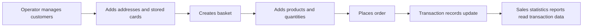
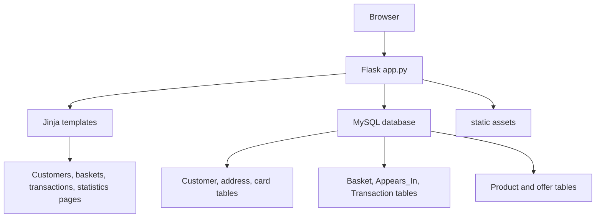
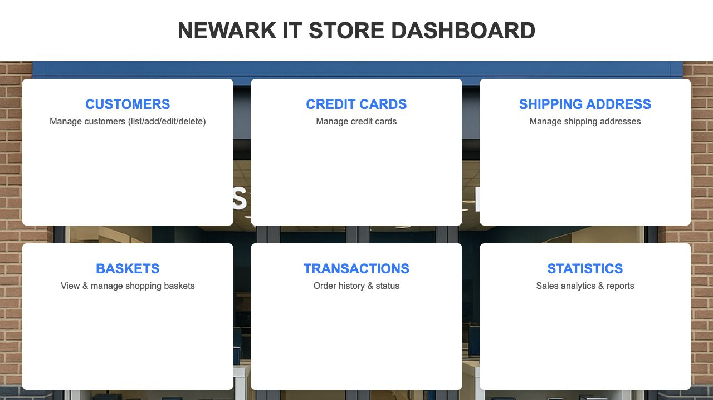
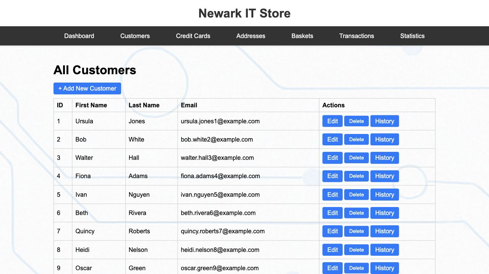

# Newark IT Store

Classic Flask and MySQL retail management system for customer records, baskets, orders, transaction history, and sales statistics.

Newark IT Store is a database-backed CRUD application built around a normalized store schema. It supports customer/address/card management, basket editing, order placement with offer pricing, transaction filtering, and date-range statistics reports.

## Contents

- [At A Glance](#at-a-glance)
- [Core Workflows](#core-workflows)
- [Architecture](#architecture)
- [Feature Map](#feature-map)
- [Tech Stack](#tech-stack)
- [Repository Map](#repository-map)
- [Screenshots](#screenshots)
- [Run Locally](#run-locally)
- [Verification](#verification)
- [Configuration](#configuration)
- [Status](#status)
- [License](#license)

## At A Glance

| Area | Details |
|---|---|
| Product | Retail database management app |
| Users | Store operators managing customers, baskets, orders, and reports |
| Core value | Demonstrates full CRUD and reporting over a relational MySQL schema |
| Backend | Flask, mysql-connector-python |
| Frontend | Jinja templates, static assets |
| Database | MySQL schema and seed data scripts |
| Security cleanup | DB password now comes from environment variables, not source code |

## Core Workflows



## Architecture



## Feature Map

| Feature | Evidence in repo |
|---|---|
| Customer CRUD | `templates/customers.html`, `new_customer.html`, `edit_customer.html` |
| Address/card management | `templates/addresses.html`, `cards.html`, edit/new templates |
| Basket workflow | `templates/baskets.html`, `basket_detail.html`, `new_basket.html` |
| Order placement | `templates/new_transaction.html`, `transactions.html` |
| Customer/card history | `templates/customer_history.html`, `card_history.html` |
| Statistics reports | `templates/stat_*.html`, `statistics.html` |
| Schema and seed data | `Project_Schema.sql`, `Project_Data.sql` |

## Tech Stack

| Layer | Technology |
|---|---|
| Web | Flask |
| Templates | Jinja2 |
| Database | MySQL |
| Driver | mysql-connector-python |
| Assets | Static PNG/CSS assets |

## Repository Map

```text
app.py              Flask routes and database access
templates/          Jinja views for CRUD and reporting
static/             Image assets
Project_Schema.sql  Database schema
Project_Data.sql    Seed data
.env.example        Local DB configuration example
docker-compose.yml  Local seeded MySQL service
requirements.txt    Python runtime dependencies
```

## Screenshots





## Run Locally

Start the seeded local MySQL database:

```bash
docker compose up -d
```

Configure environment variables:

```bash
cp .env.example .env
export MYSQL_HOST=127.0.0.1
export MYSQL_USER=root
export MYSQL_PASSWORD=newarkit-local
export MYSQL_DATABASE="Newark IT store"
export MYSQL_PORT=3307
```

Run the app:

```bash
python3 -m pip install -r requirements.txt
python3 app.py
```

## Verification

Local verification:

| Command | Result |
|---|---|
| `python3 -m py_compile app.py` | Passed |
| `docker compose up -d` | Passed; MySQL 8 initialized with schema and seed scripts |
| SQL row count check | Passed: 50 customers, 11 products, 50 transactions |
| Browser route check `/` | Passed: dashboard rendered 6 workflow cards |
| Browser route check `/customers` | Passed: 50 seeded customer rows rendered |

Screenshots were captured from the running Flask app backed by the seeded Compose database.

## Configuration

`app.py` reads database settings from environment variables:

```bash
MYSQL_HOST=127.0.0.1
MYSQL_USER=root
MYSQL_PASSWORD=
MYSQL_DATABASE=Newark IT store
MYSQL_PORT=3307
```

Do not commit real database credentials.

## Status

This is a presentable database CRUD project after credential cleanup, seed-script repair, local Compose setup, and browser-verified screenshots.

## License

MIT. See [LICENSE](LICENSE).
